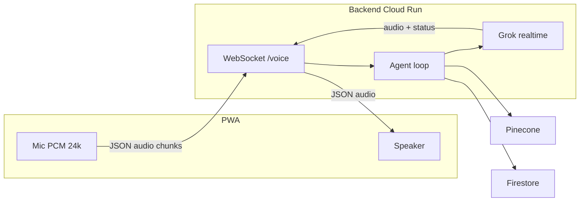

# Artemis

Artemis is a **voice-first personal AI companion** for a single user (Greg). It runs as a React PWA, talks through **xAI Grok Voice** (realtime WebSocket), remembers context in **Pinecone** with **OpenAI embeddings**, and can call tools (flights via **Duffel**, Notion scaffold). Sessions are authenticated with **Firebase Auth**; transcripts and extraction results are logged in **Firestore**.

## Architecture

| Piece | Role |
|--------|------|
| **frontend/** | Vite + React PWA (**vite-plugin-pwa**: precache shell, auto-updating service worker), Firebase client auth, mic capture as **PCM 16-bit @ 24 kHz** (base64 JSON), playback of assistant PCM chunks from the backend. |
| **backend/** | Node on **Cloud Run**: validates Firebase ID tokens on **`/voice?token=`** WebSocket upgrade, runs the agent loop, opens **Grok** at `wss://api.x.ai/v1/realtime`, proxies audio and tool calls, extracts memories after disconnect. |
| **Firestore** | User profile doc under `users/{uid}`; session logs under `users/{uid}/sessions`. |
| **Pinecone** | Namespace per `userId`, metadata `status: active \| superseded`. |
| **OpenAI** | `text-embedding-3-small` only (1536 dims). |



## Agent loop (step by step)

1. Client opens **`WS` → `/voice?token=<Firebase ID token>`**; backend verifies the token and reads `uid`.
2. **`getUserProfile(uid)`** loads Firestore preferences (optional `memoryQueryHint` for retrieval).
3. **`retrieveMemories`** queries Pinecone (top 10, `status: active`) using that hint or a default query string.
4. **`buildSystemPrompt`** injects memories + tool descriptions + date + behavior rules.
5. **`createGrokVoiceBridge`** connects to Grok, sends **`session.update`** (voice **Eve**, instructions, **server VAD**, PCM 24 kHz, registered function tools).
6. While the socket stays open, **client audio** → **`input_audio_buffer.append`**; **assistant audio** and **status** events go back to the client; completed **user** and **assistant** lines are also sent as JSON **`{ type: "transcript", role, text }`** for the in-app log. **Function calls** are executed server-side and results are returned via **`function_call_output`** + **`response.create`**.
7. On client disconnect, the bridge closes, **`extractAndStoreMemories`** runs on the text transcript, results are **`logConversation`**’d to Firestore.

## Memory model

- **During the call**: Grok’s instructions include “what we know about Greg” from Pinecone; the model behaves as if that is current context.
- **After the call**: A **text** Grok call parses the transcript into structured memory candidates. Contradictions try to **supersede** a similar vector in Pinecone; near-duplicates can be skipped; a light **conflict check** can supersede when a new fact clearly replaces an old one.
- **Vectors**: Stored with metadata `{ userId, category, timestamp, status, text }` (text stored for retrieval display).

## Adding a new tool (under ~10 minutes)

1. Create **`backend/src/tools/yourTool.js`** exporting a **`your_tool`** object `{ name, description, parameters }` (JSON Schema style) and an **`executeYourTool(params)`** async function that returns a plain JSON-serializable object (Grok will speak from it).
2. Open **`backend/src/tools/toolRegistry.js`** and add `{ definition: your_tool, execute: executeYourTool }` to the **`registry`** array.
3. Restart the backend. The tool appears in **`session.update`** automatically and in the system prompt via **`getToolDescriptionsForPrompt()`**.

No changes are required in `grokSession.js` unless you need custom client protocol messages.

## Environment variables

### `backend/.env`

| Variable | Purpose |
|----------|---------|
| `XAI_API_KEY` | Grok Voice + text (memory extraction). |
| `XAI_CHAT_MODEL` | Text model for extraction (default `grok-4-1-fast-non-reasoning`). |
| `OPENAI_API_KEY` | Embeddings only. |
| `PINECONE_API_KEY` / `PINECONE_INDEX_NAME` | Vector DB. |
| `FIREBASE_PROJECT_ID` / `FIREBASE_CLIENT_EMAIL` / `FIREBASE_PRIVATE_KEY` | Admin SDK. |
| `DUFFEL_ACCESS_TOKEN` | [Duffel](https://duffel.com) access token for flight **offer requests** (search). |
| `DUFFEL_API_BASE_URL` | Optional. Default `https://api.duffel.com`. |
| `DUFFEL_SUPPLIER_TIMEOUT_MS` | Optional. Passed as `supplier_timeout` on offer request creation. |
| `NOTION_API_KEY` | Reserved for Phase 2. |
| `PORT` | HTTP + WebSocket (default `8080`). |
| `WS_PING_INTERVAL_MS` | Server→client WebSocket **ping** interval in ms (default `30000`); `0` disables. Reduces idle disconnects behind proxies / Cloud Run. |
| `TRUST_PROXY_HOPS` | Express **trust proxy** hops (default `1`); `0` disables. Use behind Cloud Run / load balancers. |

Optional tuning: `MEMORY_SUPERSEDE_MIN_SCORE`, `MEMORY_DEDUPE_MIN_SCORE`, `MEMORY_CONFLICT_CHECK_SCORE`.

### `frontend/.env` (Vite: `VITE_*`)

| Variable | Purpose |
|----------|---------|
| `VITE_FIREBASE_*` | Web app config from Firebase console. |
| `VITE_BACKEND_WS_URL` | WebSocket base including path, e.g. `ws://localhost:8080/voice` or `wss://YOUR-RUN-URL/voice`. The client appends `?token=`. |

## PWA and offline shell

Production builds register a **service worker** (`dist/sw.js`) via **`virtual:pwa-register`** in `main.jsx`, with **`registerType: 'autoUpdate'`** so new deploys replace the cache and reload clients. The **web app manifest** is generated at **`dist/manifest.json`** from `vite.config.js` (the old static `public/manifest.json` was removed to avoid duplication). Precached assets are static files only; **voice still requires network** (WebSocket to Cloud Run and provider APIs).

## Firestore rules

**`firestore.rules`** allows each signed-in user to read/write only **`users/{theirUid}`** and **`users/{theirUid}/sessions/{sessionId}`**. The Node backend uses the **Admin SDK** and is not subject to these rules. Deploy rules (and empty **`firestore.indexes.json`**) with:

```bash
firebase deploy --only firestore
```

`./scripts/deploy-frontend.sh` runs **`firebase deploy --only hosting,firestore`**. Use **`--only hosting`** if you want to skip rules for a given release.

## Local development

1. Fill **`backend/.env`** and **`frontend/.env`** (see `.env.example` files). On boot the backend logs **missing env groups** (voice, memory, flights, notion) as warnings.
2. From the **repo root**: `npm install && npm run dev` runs **backend** and **frontend** together (`concurrently`). Or run them separately:
   - **Backend**: `cd backend && npm install && npm run dev`
   - **Frontend**: `cd frontend && npm install && npm run dev` → open the printed URL (often `http://localhost:5173`).
3. **`GET /health`** returns `OK` for Cloud Run probes. **`GET /ready`** returns **`200 { "ok": true }`** when core voice + Firebase Admin env vars are set; otherwise **`503`** (handy for stricter readiness checks).
4. Ensure Firebase **Google** sign-in is enabled and **Authorized domains** include `localhost`.
5. Hold the mic button, speak, release; you should see status changes and hear replies when Grok and keys are valid.

If Firebase web env vars are missing or still placeholders, the UI shows a short **configuration** screen instead of initializing Auth.

## Deployment

- **Backend (Cloud Run)**  
  - From repo root: `PROJECT_ID=your-gcp-project ./scripts/deploy-backend.sh`  
  - Or use the `gcloud builds submit` / `gcloud run deploy` commands from the project prompt.  
  - Set **`VITE_BACKEND_WS_URL`** on the frontend to **`wss://<run-service-url>/voice`** (no trailing slash).

- **Frontend (Firebase Hosting)**  
  - Add **`.firebaserc`** with your Firebase project id (`firebase login` / `firebase use`).  
  - `./scripts/deploy-frontend.sh` or `cd frontend && npm run build && cd .. && firebase deploy --only hosting`.  
  - `firebase.json` serves **`frontend/dist`** and SPA-rewrites to `index.html`.

**Note:** `gcloud run deploy --env-vars-file` accepts ENV or YAML. Multi-line `FIREBASE_PRIVATE_KEY` is often easier via **Secret Manager** or the Cloud Run console.

## Install as PWA on iPhone

1. Deploy or open the hosted **HTTPS** site (PWAs require a secure origin).
2. In **Safari**, tap **Share** → **Add to Home Screen**.
3. Launch **Artemis** from the icon; it opens in standalone display (see `manifest.json`).

Grant **microphone** permission when prompted.

## System prompt and personality

Artemis’s voice behavior is driven by **`backend/src/agent/systemPrompt.js`** (`buildSystemPrompt`). Edit the template string (tone, rules, memory instructions) and redeploy the backend. Tool descriptions seen by the model come from **`toolRegistry.js`** (`getToolDescriptionsForPrompt`).

---

## Repository layout

```
artemis/
├── package.json           # Root: npm run dev (backend + frontend)
├── frontend/              # Vite React PWA
├── backend/               # Cloud Run service
├── scripts/               # deploy-backend.sh, deploy-frontend.sh
├── firebase.json          # Hosting + Firestore config
├── firestore.rules        # Client-facing Firestore security
├── firestore.indexes.json # Composite indexes (empty starter)
└── README.md
```

## Troubleshooting

- **401 on WebSocket**: Token missing/expired; sign out and in, or check clock skew.
- **WebSocket drops while idle**: The backend sends periodic **pings** (`WS_PING_INTERVAL_MS`, default 30s). If you still see disconnects, lower the interval or raise Cloud Run / proxy timeouts.
- **No audio back**: Confirm Grok key, browser autoplay (user gesture helps), and that chunks are PCM 24 kHz on the wire (see `useVoiceSession.js`). The client **awaits `AudioContext.resume()`** on push-to-talk and on the capture context after `getUserMedia` for **Safari / iOS**.
- **Pinecone empty on first run**: Normal until the first post-session extraction runs with enough transcript text.
